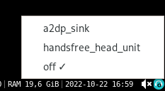

## About
Tool for a fast change audio profile on your headphones with pulse audio


## How to use
1) install requirements ```pip install -r requirements.txt```
2) run in background ```python pa-profile-switch.py```

## How it works

Listen to pulse audio events and create a systray icon if the audiocard is two or more profiles connected.

Set the new card as default sink and source.

Change a profile,  if you click the systray menu item


